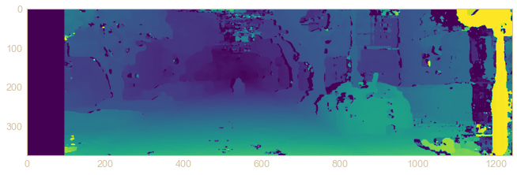
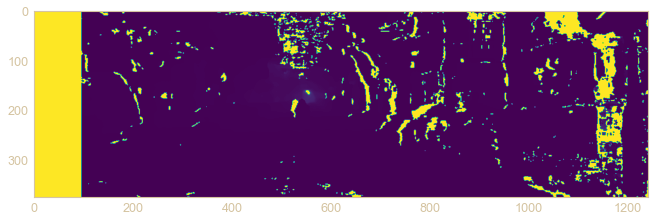
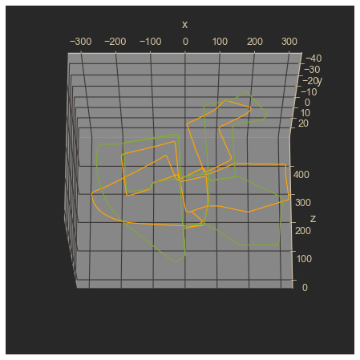

# KITTI Odometry in Python and OpenCV - Beginner's Guide to Computer Vision

This repository contains a Jupyter Notebook tutorial for guiding intermediate Python programmers who are new to the fields of Computer Vision and Autonomous Vehicles through the process of performing visual odometry with the [KITTI Odometry Dataset](http://www.cvlibs.net/datasets/kitti/eval_odometry.php). There is also a [video series on YouTube](https://www.youtube.com/watch?v=SXW0CplaTTQ&list=PLrHDCRerOaI9HfgZDbiEncG5dx7S3Nz6X) that walks through the material in this tutorial.

The tutorial will start with a review of the fundamentals of computer vision necessary for this task, and then proceed to lay out and implement functions to perform visual odometry using stereo depth estimation, utilizing the opencv-python package. Motion will be estimated by reconstructing 3D position of matched feature keypoints in one frame using the estimated stereo depth map, and estimating the pose of the camera in the next frame using the solvePnPRansac() function. It will then use this framework to compare performance of different combinations of stereo matchers, feature matchers, distance thresholds for filtering feature matches, and use of lidar correction of stereo depth estimation.

The final estimated trajectory given by the approach in this notebook drifts over time, but is accurate enough to show the fundamentals of visual odometry. This will be an ongoing project to improve these results in the future, and more tutorials will be added as developments occur.

Please reach out with any comments or suggestions!

### How to use this repository:

Clone this repository into a folder which also contains your download of the KITTI odometry dataset in a separate folder called 'dataset'. The tutorial is contained in the KITTI_visual_odometry.ipynb jupyter notebook.

### Sample Images:

Stereo disparity map of first sequence image:

Estimated depth map from stereo disparity:

Final estimated trajectory vs ground truth:

### Contents:

- KITTI_visual_odometry.ipynb - Main tutorial notebook with complete documentation.
- functions_codealong.ipynb - Notebook from the video tutorial series.